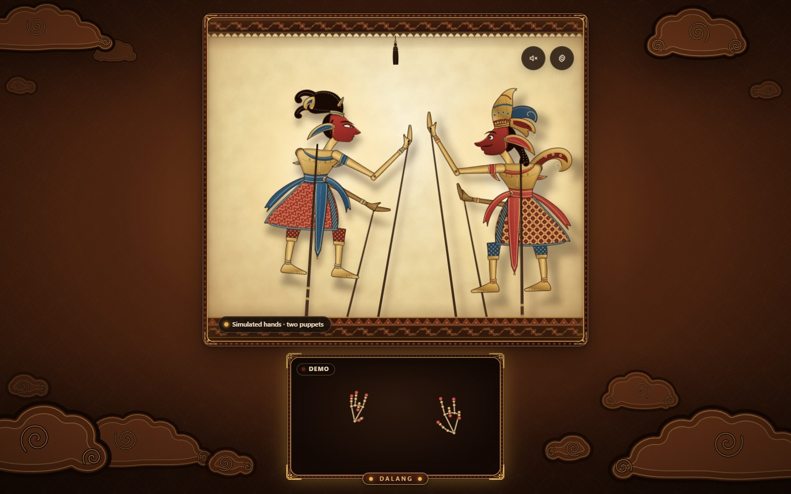
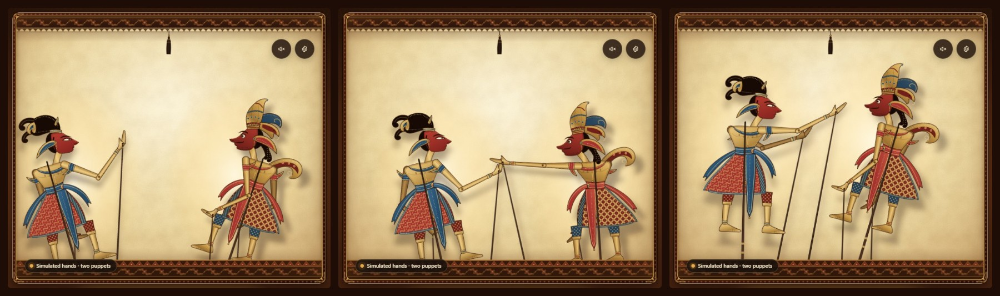
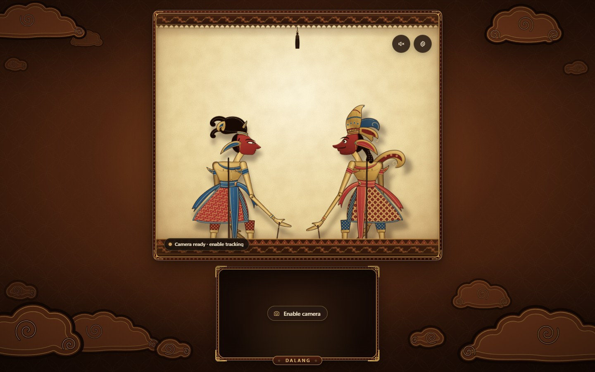
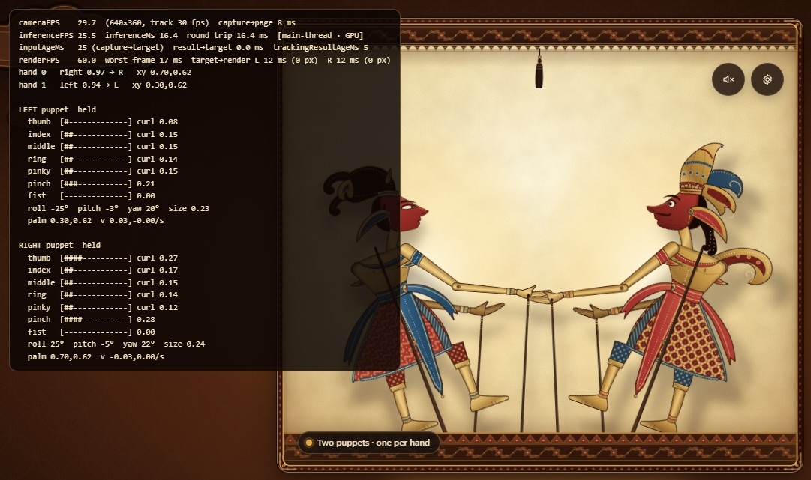
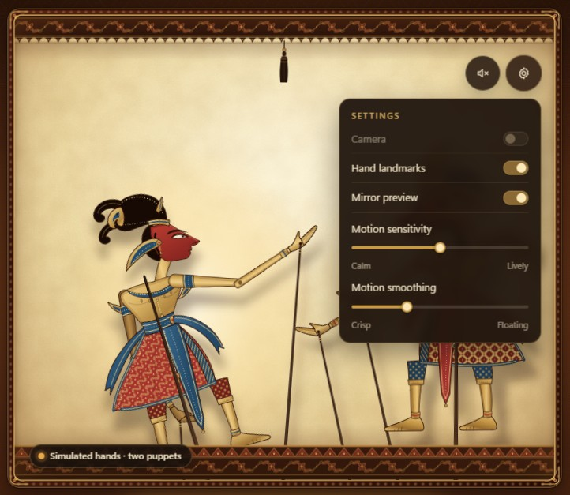
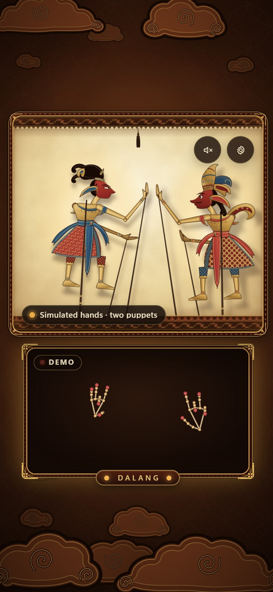
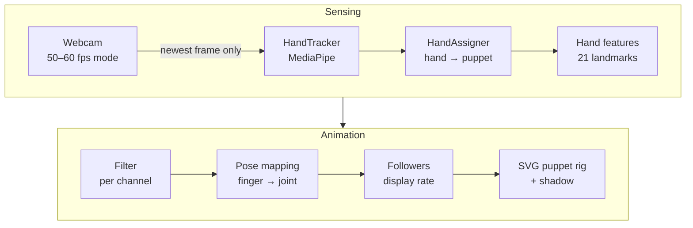

<div align="center">

# Dalang

### A Wayang Kulit shadow theatre you perform with your bare hands

Raise both hands to your webcam. Each hand becomes the dalang's grip on an
ornate shadow puppet that walks, leans, gestures and casts a lamp-lit shadow,
following every finger.

[**Live demo**](https://dalang.hongvan.net) ·
[How to play](#how-to-play) ·
[How it works](#how-it-works) ·
[Deploying](DEPLOY.md)




</div>

## Highlights

- **Two hands, two puppets.** Your left hand holds the puppet on the left,
  your right hand the one on the right, like a mirror.
- **Every finger counts.** Each finger drives its own joint, continuously.
  There are no gestures to learn and no dead zones: a slight bend of one
  finger, a small turn of the wrist or a centimetre of palm travel already
  shows on the puppet.
- **It feels immediate.** A puppet moves together with your hand in the
  preview and is in your hand about 100 ms after you raise it.
  See [Measured performance](#measured-performance).
- **Private by design.** Hand tracking runs in your browser. There is no
  server, and the video never leaves your device.
- **Original artwork.** Puppets, ornaments, clouds and textures are SVG drawn
  for this project. Sound is generated with Web Audio; there are no audio files.
- **Works without a camera.** `?simulate=1` plays a scripted show with
  synthetic hands.

## Screenshots

<table>
  <tr>
    <td colspan="2">
      
      <p align="center"><sub>Each puppet follows one hand: position, lean, both arms, wrists and fingers.</sub></p>
    </td>
  </tr>
  <tr>
    <td width="50%" valign="top">
      
      <p align="center"><sub>First visit. The puppets rest until you enable the camera.</sub></p>
    </td>
    <td width="50%" valign="top">
      
      <p align="center"><sub><code>?debug=1</code> shows where the time goes, and every finger channel.</sub></p>
    </td>
  </tr>
  <tr>
    <td width="50%" valign="top" align="center">
      
      <p align="center"><sub>Settings: camera, landmark overlay, mirroring, sensitivity and smoothing.</sub></p>
    </td>
    <td width="50%" valign="top" align="center">
      
      <p align="center"><sub>Phone layout.</sub></p>
    </td>
  </tr>
</table>

## Quick start

You need a current Node.js LTS release and [Yarn](https://classic.yarnpkg.com/) 1.x.

```bash
git clone https://github.com/lahieuphong/dalang.git
cd dalang
yarn install
yarn dev            # http://localhost:5173
```

| Command          | What it does                                              |
| ---------------- | --------------------------------------------------------- |
| `yarn dev`       | Development server with hot reload                        |
| `yarn build`     | Type-check, then build the production site into `dist/`   |
| `yarn preview`   | Serve the production build locally                        |
| `yarn typecheck` | Type-check only                                           |

`yarn dev` and `yarn build` first run `scripts/setup-mediapipe.mjs`. It copies
the MediaPipe WASM runtime from `node_modules` into `public/mediapipe/wasm` and
downloads `public/models/hand_landmarker.task` if it is missing.

The camera needs a secure context: `localhost` or HTTPS.

## How to play

Sit so both hands fit in the camera view, palms toward the camera, and keep
them apart. Good light helps the tracker.

| Your hand                        | The puppet                                              |
| -------------------------------- | ------------------------------------------------------- |
| Show a hand                      | Lifts its puppet up from behind the rail                |
| Move left / right                | Walks across its half of the stage                      |
| Raise high / lower               | Lifts the puppet higher / lets it sink                  |
| Roll the wrist                   | Leans the body forward or back                          |
| **Index**: curl / extend / aim   | Front shoulder: lowers / raises / aims the arm          |
| Index alone (others curled)      | Points the front arm at the other puppet                |
| **Middle**: curl                 | Bends the front elbow                                   |
| **Thumb**: spread / curl         | Turns the front wrist                                   |
| **Thumb–index pinch**            | A precise grip, felt over the whole approach of the two fingertips: wrist turns in, forearm draws in, fingers close, head nods |
| **Ring**: curl / extend          | Lowers / raises the back arm                            |
| **Pinky**: curl / extend         | Bends / straightens the back elbow                      |
| Close the whole hand             | Compacts both arms, the puppet's hands close            |
| Bring the hand toward the camera | Draws the puppet toward the lamp: bigger, softer shadow |

### Settings and sound

The gear button opens the settings. They are saved in `localStorage`; camera
permission is never stored.

| Setting            | Effect                                                                                  |
| ------------------ | --------------------------------------------------------------------------------------- |
| Camera             | Turns the webcam on or off                                                              |
| Hand landmarks     | Draws the tracked hand skeleton over the preview                                        |
| Mirror preview     | Shows the preview like a mirror (on by default)                                         |
| Motion sensitivity | Gain: how far the puppet moves for a given hand movement, 0.75× to 1.75× (default 1.25×) |
| Motion smoothing   | Filtering: how firmly a resting hand is held still                                      |

Sensitivity and smoothing are independent, and the defaults are already the
fast setting.

The speaker button starts a quiet, generated gamelan-style ambience, and you
hear a cempala knock when a puppet is picked up. Sound is off until you click.

## How it works



| Stage      | Module                               | What it does                                                                                                         |
| ---------- | ------------------------------------ | -------------------------------------------------------------------------------------------------------------------- |
| Camera     | `useCamera`                          | Asks for a 50–60 fps mode at a modest resolution, then 30 fps, then anything; reads back the mode actually granted    |
| Tracking   | `HandTracker`, `inferenceBackend`    | MediaPipe HandLandmarker (GPU, CPU fallback) driven by `requestVideoFrameCallback`; frames are never queued           |
| Assignment | `HandAssigner`                       | Pairs each hand with a puppet by screen side and keeps the pairing while the hand is tracked                          |
| Features   | `handMath`                           | Turns 21 landmarks into per-finger curl and direction, thumb spread, pinch distance, finger spread, roll, pitch, fist and depth |
| Filtering  | `HandFeatureFilter`, `smoothing`     | One noise-aware filter per channel; the only place the signal is smoothed                                             |
| Mapping    | `puppetMapping`                      | Response curve × sensitivity; each finger drives its own joint; the palm (predicted up to 25 ms ahead) places the puppet |
| Motion     | `PuppetController`                   | Stiff, critically damped followers carry the pose to the display rate; a slight follow-through adds weight            |
| Rendering  | `Puppet`, `StageScene`               | Transforms set directly on SVG groups; a blurred silhouette copy is the shadow                                        |

<details>
<summary><b>Design notes</b></summary>

- **A single loop.** `WayangExperience` runs one `requestAnimationFrame` loop.
  Per-frame data lives in refs and plain objects. React state only holds
  coarse UI state: camera status, model status, the number of hands held, and
  settings.
- **Latency first.** `HandTracker` is driven by `requestVideoFrameCallback`:
  each new camera frame is offered once, the model never works on two frames
  at once, and a frame that arrives while it is busy only replaces the one
  waiting. Nothing queues and the model always gets the newest frame. On the
  main thread, inference runs inside the frame callback, so its result drives
  the very render frame that follows; a running time budget (60 %) keeps it
  from crowding out rendering.
- **Main thread or worker.** The main thread is the shortest path from a
  camera frame to a pose, so tracking starts there. When one inference keeps
  costing about two display frames (over 32 ms for six seconds), the model is
  also started in a Web Worker and auditioned on the live frames for a few
  seconds, next to normal tracking. Tracking then moves to the worker, which
  keeps rendering smooth on slower machines, unless the worker's round trip
  is more than twice what the main thread needs at that moment (workers are
  easily starved on a busy machine).
- **One smoothing stage.** Each channel has a One Euro filter that measures
  the channel's own noise as it runs. A change larger than that noise passes
  on the very frame it is seen; smaller ones still pass, over a few frames; a
  resting hand is held still. Pinch and finger curl are the fastest channels,
  then palm position and roll; pitch, yaw and depth are calm. Nothing is
  debounced. A single-frame tracker glitch is halved rather than delayed.
- **Sensitivity is not smoothing.** Finger curl is linear in the joint angles
  and goes through a response curve that amplifies small movements (0.1 →
  0.17, 0.2 → 0.31, 0.5 → 0.64) without flattening the far end; the ring and
  little fingers get extra gain. The pinch is linear over the whole approach
  of thumb and index. Each palm is mapped around its own home position, so
  more sensitivity means more travel, not puppets pushed to the edges; stage
  limits are eased, never hard.
- **Followers, not springs to chase.** Between tracker results the pose is
  carried to the display rate by very stiff, critically damped followers
  (exact integration, so they never ring): fastest for wrist and finger
  blades, then root and arm joints, softer for body and head. They add about
  one display frame. Physical character (arms trailing a fast move, the
  shadow lagging) is a small, well-damped layer on top and never delays
  control.
- **Stable assignment.** A newly raised hand takes the puppet on its side of
  the preview. MediaPipe handedness only breaks ties for hands right in the
  middle. While a hand is tracked, continuity (distance from that puppet's
  last palm position) wins, so crossing hands or a mislabelled frame never
  swaps puppets.
- **Mirroring.** Landmarks are mirrored into view space when the preview is,
  so the overlay canvas is never flipped.
- **Transitions.** Without a hand, a puppet rests low with its lower legs
  hidden behind the rail. When a hand appears, its pose takes over at once.
  When a hand is lost, its pose is held for 300 ms, then the puppet eases
  back down to its breathing rest pose.
- **Shadows.** Each puppet is rendered twice. The second copy is a flat
  silhouette that goes through a Gaussian blur. It is offset away from the
  lamp and scaled around it, so the shadow grows and softens as the puppet
  nears the lamp.

</details>

## Measured performance

| What                                                           | Result                                           |
| -------------------------------------------------------------- | ------------------------------------------------ |
| Puppet against the hand in the preview, slow movement          | within ±11 ms                                    |
| Puppet against the hand in the preview, fast 100 ms move       | 9–11 ms behind at the halfway point              |
| Camera capture → pose (`inputAgeMs`)                           | 19–24 ms                                         |
| Hand tracking                                                  | every camera frame (30/s), 12–15 ms per frame    |
| Rendering                                                      | 60 fps, no frame over 25 ms                      |
| Picking a puppet up                                            | 25 % on the first frame, 90 % after 100 ms, no overshoot |
| A held puppet while the hand is still                          | 0.02–0.08 px of jitter                           |

Measured on the production build in headless Chrome 154 on a desktop with an
RTX 3090, against a recorded 640×360, 30 fps clip fed in as the camera, with
the machine otherwise idle. Lag is measured against the preview's own pixels
in the same render frame. On the same machine under heavy load, inference
rises to about 30 ms and rendering drops to about 45 fps.

A real webcam adds its own latency before the browser sees a frame. The debug
readout shows it as `capture→page`.

## Developer flags

Add these to the URL. They combine, for example `?simulate=1&debug=1`.

| Flag                               | Effect                                                                     |
| ---------------------------------- | -------------------------------------------------------------------------- |
| `?debug=1`                         | Shows the readout below, refreshed about six times a second                |
| `?simulate=1`                      | Drives the puppets with synthetic, scripted hands; no camera needed        |
| `?tracker=main` / `?tracker=worker` | Pins where the model runs instead of letting the app choose                |
| `?delegate=cpu`                    | Forces the CPU delegate                                                    |

The debug readout:

| Line                    | Meaning                                                                                              |
| ----------------------- | ---------------------------------------------------------------------------------------------------- |
| `cameraFPS`             | Frames the camera delivers, the granted mode, and `capture→page` (camera latency, where reported)   |
| `inferenceFPS`, `inferenceMs` | Tracking rate and cost, the round trip, and where the model runs (`main-thread` / `worker`, `GPU` / `CPU`) |
| `inputAgeMs`            | Camera capture → that frame's result driving the pose                                                 |
| `result→target`         | The wait for the next render frame                                                                   |
| `trackingResultAgeMs`   | How old the result on screen is, on average                                                          |
| `renderFPS`             | Render rate and the worst frame of the last second                                                   |
| `target→render`         | How far the rendered puppet trails its target, in ms and stage pixels                                |
| Hands and puppets       | The hand-to-puppet assignment and, per held puppet, a bar for every finger, pinch, fist, roll, pitch and palm velocity |

## Project structure

```
src/
  components/
    WayangExperience.tsx  orchestration and the animation loop
    TheaterStage.tsx      carved frame and lamp-lit screen
    StageScene.tsx        SVG scene: shadows, puppets, valance, tassel, rail
    Puppet.tsx            articulated puppet rig (imperative apply(rig))
    puppet/               original puppet artwork and palettes
    Backdrop.tsx          gradients, kawung batik, mega-mendung-style clouds
    WebcamPreview.tsx, HandOverlay.tsx, StageControls.tsx,
    SettingsPopover.tsx, StatusPill.tsx, DebugPanel.tsx, icons.tsx
  hooks/                  useCamera, useHandTracking, useAnimationFrame,
                          usePreferences, useParallax
  lib/
    handTracker.ts        camera frames → model → results, never queued
    inferenceBackend.ts   main-thread and worker backends, GPU / CPU fallback
    tracker.worker.ts     the model in a Web Worker
    handMath.ts           landmarks → hand features
    handFeatureFilter.ts  per-channel filtering
    handAssignment.ts     hand → puppet pairing
    puppetMapping.ts      features → pose
    puppetMotion.ts       followers, pickup and release
    smoothing.ts          noise-aware One Euro filter, exact spring
    …                     puppetGeometry, drawHands, ambientAudio, status,
                          settings, simulatedHands, createHandLandmarker,
                          trackerProtocol
  styles/wayang.css
  assets/textures/        tiny SVG textures (paper, grain, kawung, floral trim)
public/                   model, favicon, social image, server configs
scripts/                  setup-mediapipe.mjs
docs/screenshots/         images used in this README
```

## Deployment

Dalang is a static site. `yarn build` writes everything to `dist/`
(about 43 MB; a visitor downloads about 20 MB of it: one WASM runtime and the
model). Upload the contents of `dist/` to the web root of any host that
serves HTTPS.

[DEPLOY.md](DEPLOY.md) (in Vietnamese) has the step-by-step guide for
`dalang.hongvan.net`, including the IIS `web.config`, the Apache `.htaccess`,
an Nginx example and a post-deploy checklist.

## Browser support and privacy

- Needs camera access in a secure context, WebAssembly and WebGL 2.
- Developed and tested in desktop Chrome. Where `requestVideoFrameCallback`
  is missing, the tracker falls back to polling from the render loop.
- The video is processed in the page and never uploaded. There are no
  analytics and no accounts.
- The hand model and the WASM runtime are served from the site itself. Only
  if they cannot be loaded does the app fall back to the public MediaPipe CDN
  and Google Storage URLs.
- If the camera or the model is unavailable, the theatre still renders and
  the puppets idle. A small status line explains what happened.

## Credits

- All artwork is original SVG drawn for this project: puppets, ornaments,
  clouds and textures.
- Hand tracking is [MediaPipe Hand Landmarker](https://ai.google.dev/edge/mediapipe/solutions/vision/hand_landmarker)
  (`@mediapipe/tasks-vision`, pinned to an exact version; the JavaScript
  bundle, the copied WASM files and the CDN fallback must all match). Three
  builds of the runtime are shipped: SIMD and non-SIMD for the main thread,
  and the ES-module build for the worker.
- The hand model (`hand_landmarker.task`, about 7.8 MB) is Apache-2.0.
- Wayang Kulit is the shadow-puppet theatre of Java and Bali; the dalang is
  its puppeteer.
